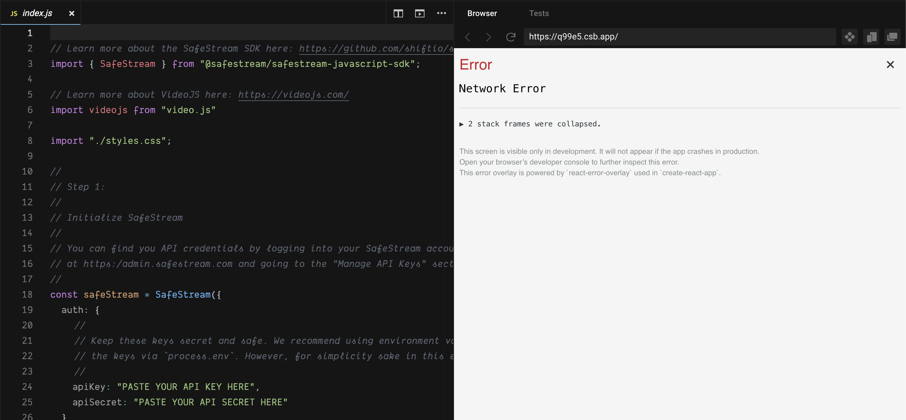

# SafeStream Player Example

This repository is here to be an example for playing a SafeStream protected video in the browser.

SafeStream provides realtime, dynamic watermarks for your video content.

## The Example

The full example is in [src/index.js](src/index.js). The file explains each step of getting a watermarked video stream through SafeStream.

## Getting started

### Step 1 - Install

To run this example locally:

```bash
git clone https://github.com/shiftio/safestream-player-example.git
npm i
```

Alternatively, you can run it on CodeSandbox:

[](https://codesandbox.io/s/safestream-player-example-65g1i)

### Step 2 - Configure
Set your API credentials in `src/index.js`

```javascript
//
// Step 1:
//
// Initialize SafeStream
//
// You can find you API credentials by logging into your SafeStream account 
// at https:/admin.safestream.com and going to the "Manage API Keys" section
//
const safeStream = SafeStream({
    auth: {
        //
        // Keep these keys secret and safe. We recommend using environment variables and accessing 
        // the keys via `process.env`. However, for simplicity sake in this example, we've hard coded them.
        //
        apiKey: "<PASTE YOUR API KEY HERE>",
        apiSecret: "<PASTE YOUR API SECRET HERE>"
    }
});
```

### Step 3 - Running it

If you're running the project locally, you can start the server using

```bash
npm start
```

If you're running on CodeSandbox the project will automatically run for you. 

#### Note for CodeSandbox
You'll need to add the codesandbox domain to SafeStream by visiting the "Manage Domains" section of the [SafeStream console](https://admin.safestream.com). You should see this before you've added the domain to SafeStream:



In the image above the domain that would need to be added is `q99e5.csb.app` based on the browser URL bar in the right window.


